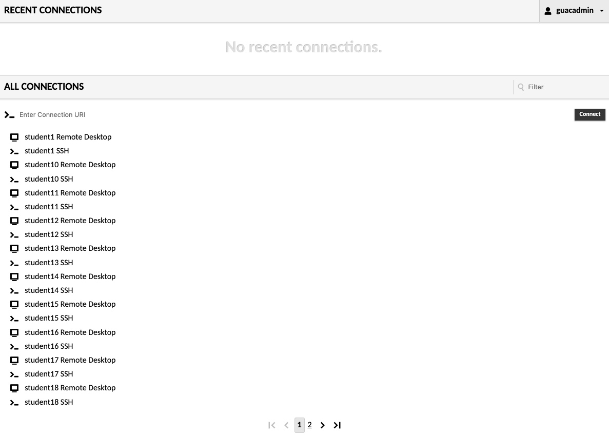
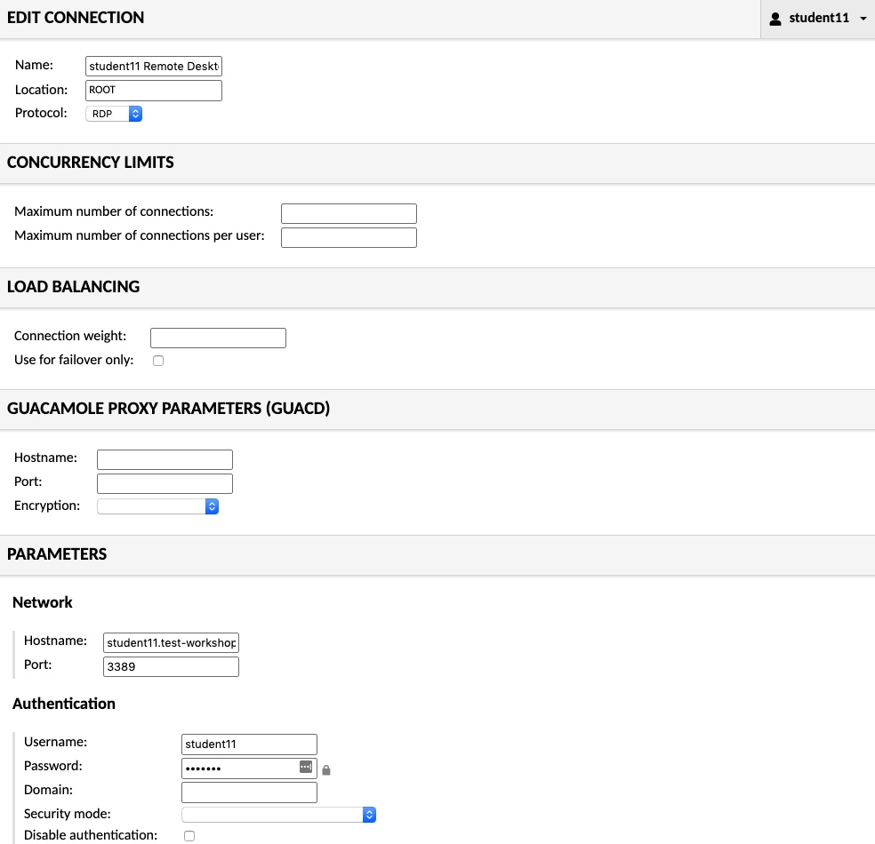

populate_guacamole
--------------

This role takes input variables and populates the AWS Apache Guacamole Bastion Host with Users for Red Hat Linklight workshops, and associated SSH and RDP Connections


Requirements
------------
An Apache Guacamole Bastion Host must already be running and referenced in your ansible inventory. This role assumes use of the AWS Marketplace Guacamole Bastion Server: https://aws.amazon.com/marketplace/pp/B06Y67KPD9

Role Variables
--------------
`GUAC_USERNAME`: The administrator username for your Guacamole Server. This is typically `guacadmin`.

`GUAC_PASSWORD`: The administrator password for your Guacamole Server. For AWS, the default password is the ***instance ID***

`student_total`: The total number of users for your Guacamole server. Each user will have the following username: studentX, where X is the number

`password`: This is the password that students will use to log in. The default value is `ansible`.

`ec2_name_prefix`: The prefix for your Linklight login url
domain: The domain for your Linklight login url

The entire URL will have the format of studentX.ec2_name_prefix.domain. i.e., `student1.test-workshop.ansible.com`

Example Inventory
----------------

```
[guacamole]
18.205.67.151 ansible_host=18.205.67.151 ansible_user=ec2-user ansible_ssh_private_key_file=~/.ssh/useast-1-key.pem

```
Example Input/Extra Variables
----------------
```
GUAC_USERNAME: guacadmin
GUAC_PASSWORD: password
student_total: 20
ec2_name_prefix: test-workshop
domain: rhdemo.io
password: ansible
```

Example Playbook
----------------

```
---
- name: Populate Apache Guacamole with Users and Connections
  hosts: guacamole
  gather_facts: False

  tasks:

    - name: Set guacamole_server fact
      set_fact:
        guacamole_server: "{{ ansible_host }}"

    - name: Invoke populate_guacamole role
      include_role:
        name: populate_guacamole
      with_sequence: start=1 count="{{ student_total }}"

    - name: Clean Up JSON Files
      file:
        path: "{{ playbook_dir }}/{{ item }}"
        state: absent
      with_items:
        - rdp_connection.json
        - ssh_connection.json
        - users.json
      delegate_to: localhost
```
Playbook Run Results
----------------

As a result of running the example playbook with the example extra variables above:

1) Logging in as `guacadmin` will reveal that all Users and their associated SSH and RDP Connections are now present.



2) Logging in as a particular student will show that said student will only be able to access their particular connections (this is what we want to prevent a student from logging into his/her neighbor's workbench).


3) Under the settings, you will see the details for the connection have been populated per variable inputs.


